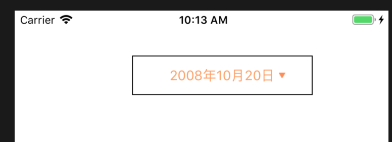
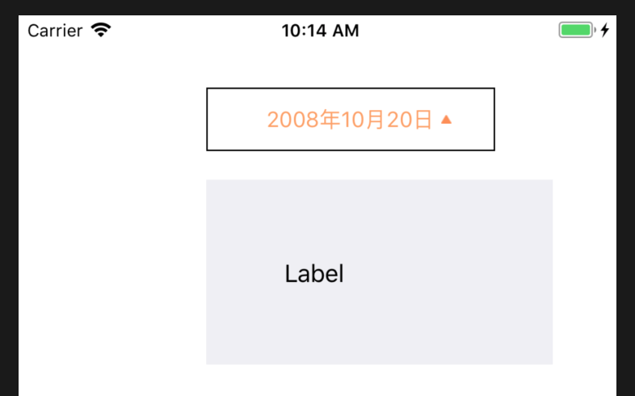

# 带小尾巴的按钮

## Demo





## 用法

```
 (void)viewDidLoad {
    [super viewDidLoad];
    _button = [[TailedButton alloc]initWithFrame:CGRectMake(130, 50, 200, 44)];
    _button.title = @"2008年10月20日";
    _button.layer.borderColor = [UIColor blackColor].CGColor;
    _button.layer.borderWidth = 1;

    [self.view addSubview:_button];
    
    [_button addTarget:self action:@selector(buttonClicked:) forControlEvents:UIControlEventTouchUpInside];
    
}

-(void)buttonClicked:(TailedButton*)sender{
    sender.selected = !sender.selected;
    if(!sender.isSelected){
        _vwDropMenu.hidden = YES;
        _vwDropMenuHeight.constant = 0;
        
    }else{
        _vwDropMenu.hidden = NO;
        _vwDropMenuHeight.constant = 128;
    }
}
```